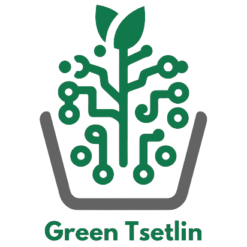

.. green_tsetlin documentation master file, created by
   sphinx-quickstart on Mon Apr  8 10:29:42 2024.
   You can adapt this file completely to your liking, but it should at least
   contain the root `toctree` directive.

_____________________________________________

Green Tsetlin documentation
=========================================

Green Tsetlin (GT) is a Tsetlin Machine (TM) 
framework developed to solve real-world problems using TMs.
Several frameworks already exist that provide access to TM
implementations. However, these either lack features or have a
research-first focus. GT is an easy-to-use framework that aims
to lower the complexity and provide a production-ready TM
implementation that is great for experienced practitioners and
beginners.

More details on the framework: `ArXiv paper <https://arxiv.org/pdf/2405.04212>`_

Software can be found here: `GitHub <https://github.com/ooki/green_tsetlin>`_

installation
=============
PyPI install, presuming you have build-essential installed (ubuntu).

.. code-block:: bash

   pip install green-tsetlin

User Guide 
===========

.. toctree::
   :maxdepth: 2

   userguide
   

Tutorials
==========

.. toctree::
   :maxdepth: 2

   imdb
   iris
   amazon
   mnist

Indices and tables
===================

* :ref:`genindex`
